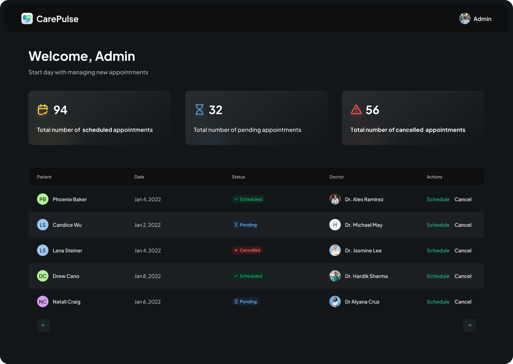

# CarePulse 🩺💉

CarePulse is a healthcare web application built using Next.js. It allows users to schedule and manage their medical appointments, providing an intuitive and seamless experience to interact with healthcare providers. 🌐



## Features ✨

- **Appointment Scheduling**: Users can submit appointment requests with their preferred doctor and schedule. 🗓️
- **Doctor Information**: Displays detailed information about doctors, including their name, image, and specialization. 👩‍⚕️👨‍⚕️
- **Success Confirmation**: After a successful appointment request, users receive a confirmation message with appointment details. ✅
- **Mobile-Friendly**: The app is fully responsive, ensuring a smooth experience on both desktop and mobile devices. 📱💻

## Tech Stack 🛠️

- **Frontend**:

  - Next.js (React-based framework) ⚛️
  - Tailwind CSS (Utility-first CSS framework) 🎨
  - Radix UI (Accessible UI components) 🛠️
  - React Hook Form (Forms handling) 📝
  - Lucide React (Icons) 🔲

- **Backend**:

  - Appwrite (Backend-as-a-Service for managing databases and authentication) 🗄️

<!-- - **State Management**: React state management 📊 -->

- **Styling**: Tailwind CSS with animations 💫

## Installation 🛠️

To run the project locally, follow these steps:

### 1. Clone the repository

```
git clone https://github.com/d-code-h/carepulse.git
cd carepulse
```

### 2. Install dependencies using Bun

Make sure you have Bun installed on your machine. If you don't have it yet, you can install it from Bun's official website. Then, run:

`bun install`

### 3. Set up environment variables

Create a .env.local file in the root directory of the project and add your environment variables:

```
NEXT_PUBLIC_ENDPOINT=
PROJECT_ID=
API_KEY=
DATABASE_ID=
PATIENT_COLLECTION_ID=
DOCTOR_COLLECTION_ID=
APPOINTMENT_COLLECTION_ID=
NEXT_PUBLIC_BUCKET_ID=
NEXT_PUBLIC_ADMIN_PASSKEY=
SENTRY_AUTH_TOKEN=
```

### 4. Run the development server

After installing the dependencies and setting up the environment, run the application in development mode:
`bun run dev`

You can access the app at http://localhost:3000.

### 5. Build and start the production server

To build the app for production and start the server, run:

```
bun run build
bun run start
```

## Available Scripts 🎬

- **bun run dev:** Runs the app in development mode. 🌱
- **bun run build:** Builds the app for production. 🏗️
- **bun run start:** Starts the production server. 🚀
- **bun run lint:** Lints the project files for quality assurance. 🧐

## Libraries and Dependencies 📚

### Core Dependencies:

- **@radix-ui/react- components:** For building accessible UI components like dialogs, checkboxes, and dropdowns.
- **@tanstack/react-table:** A powerful table library for building customizable and data-rich tables.
- **react-datepicker:** A date-picker library to select dates easily.
- **zod:** A schema validation library used to ensure that inputs are correct and safe.
- **lucide-react:** Icons used throughout the app.
- **input-otp:** OTP (One-Time Password) input component for secure authentication.

### Styling:

- **tailwindcss:** Utility-first CSS framework for building custom designs.
- **tailwind-merge:** Merges Tailwind classes to avoid conflicts.
- **tailwindcss-animate:** Add animations to Tailwind CSS classes.

### TypeScript and Linting:

- **typescript:** Static type-checking for improved code quality and editor support.
- **eslint:** A tool for identifying and fixing linting issues in your code.

## Folder Structure 📂

- **app/:** Contains the route components for the app.
- **components/:** Reusable UI components such as buttons, forms, and headers.
- **lib/:** Utility functions and actions for API calls.
- **public/assets/:** Static assets like images, icons, and gifs.
- **constants/:** Stores static data, such as doctor information.

## Contributing 🤝

We welcome contributions! If you want to improve or add new features, please fork the repository, create a branch, and submit a pull request.

## License 

This project is licensed under the MIT License. See the [LICENSE](./LICENSE) file for details.
